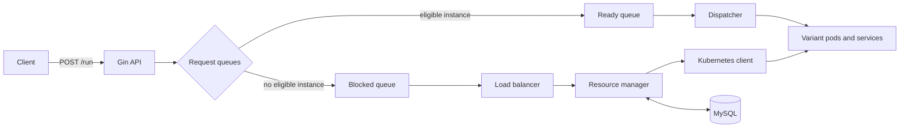

# Kubernetes ML Function Scheduler

An experimental Go control plane for placing machine-learning function variants
on Kubernetes. A request specifies a task, minimum accuracy, and deadline; the
scheduler selects a registered variant, accounts for GPU resources, starts a
pod and service when needed, and dispatches work to a running instance.

> **Project status:** research prototype. It assumes a local MySQL database and
> an accessible Kubernetes cluster, and is not hardened for production use.

## What is implemented

- HTTP API for registering variants and submitting function requests
- Accuracy-aware request queues for ready and blocked work
- Kubernetes node discovery, pod/service creation, and pod monitoring
- Variant placement using GPU memory, GPU cores, startup latency, throughput,
  and colocation information
- Round-robin dispatch across running instances
- Load monitoring and instance scale operations
- Request lifecycle logging to MySQL
- Python workload generators, simulators, plotting scripts, and sample
  variants for object detection, sentiment analysis, and summarization

## Architecture



`ResourceManager` owns the in-memory task, variant, instance, request, and node
stores. Background loops monitor Kubernetes pods, scale capacity, unblock
requests, and dispatch ready work.

## Requirements

- Go 1.20
- A Kubernetes cluster reachable through the current kubeconfig
- MySQL on `localhost:3306`
- GPU-labelled nodes and compatible container images for GPU variants

The current prototype expects a MySQL database named `vroom` and the local
development credentials `vroom:vroom`. Use an isolated development database;
the credentials are currently compiled into `database.go`.

```sql
CREATE DATABASE vroom;
CREATE USER 'vroom'@'%' IDENTIFIED BY 'vroom';
GRANT ALL PRIVILEGES ON vroom.* TO 'vroom'@'%';
```

## Build and run

```bash
git clone https://github.com/xzaviourr/kubernetes-ml-function-scheduler.git
cd kubernetes-ml-function-scheduler
go mod download
go build ./...
go run .
```

The API listens on `0.0.0.0:8083`.

## API

Register a model/function variant:

```bash
curl -X POST http://localhost:8083/insert \
  -H 'Content-Type: application/json' \
  -d '{
    "task-identifier": "image-recognition",
    "gpu-memory": 4096,
    "gpu-cores": 1,
    "image": "registry.example/image-recognition:latest",
    "startup-latency": 4,
    "min-latency": 25,
    "mean-latency": 40,
    "max-latency": 80,
    "accuracy": 90,
    "batch-size": 1,
    "end-point": "/predict",
    "port": 8080,
    "capacity": 10
  }'
```

Submit work using the fields defined by `FuncReq` in
[`request.go`](./request.go):

```bash
curl -X POST http://localhost:8083/run \
  -H 'Content-Type: application/json' \
  -d '{"task-identifier":"image-recognition","deadline":2000,"accuracy":85,"request-size":1,"args":"","response-url":""}'
```

## Repository map

| Area | Purpose |
| --- | --- |
| `apiServer.go`, `request.go` | API and request model |
| `scheduler.go`, `dispatcher.go` | queues, scheduling, and request forwarding |
| `resourceManager.go`, `variant.go`, `instance.go`, `node.go` | resource state |
| `kubernetesClient.go` | Kubernetes discovery and workloads |
| `loadBalancer.go` | capacity monitoring and scaling |
| `database.go`, `logger.go` | MySQL persistence |
| `simulator.py`, `workload_generator.py`, `profiler/` | experiments and analysis |
| `variants/` | sample ML-serving containers |

## Validation

```bash
go test ./...
```

There are currently no automated test files; this command compiles all Go
packages. Integration validation additionally requires MySQL, Kubernetes, and
the referenced model images.

## Limitations

- Configuration and development database credentials are hard-coded.
- Shared scheduler maps are accessed by concurrent goroutines without an
  explicit synchronization layer.
- API authentication, authorization, TLS, retries, and admission controls are
  not implemented.
- Included CSV/PNG files are experiment artifacts, not published benchmarks.
- Run only against a disposable cluster until configuration and security
  controls are added.

## License

Released under the [MIT License](./LICENSE).
